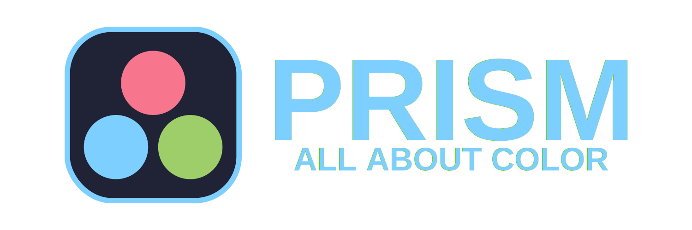

# Description

Prism is a utility library for managing colors and colorspaces written in Zig.  

> **NOTE**  
> Prism is still under active development.  
> Please, raise an issue, if you encounter any bugs.

# Why Prism?
Prism is lightweight, fast, and easy to use in general. There is no boilerplate, just import the library, and start using colors and convert them into any of supported colorspaces, including CIE l\*a\*b\*, which is a highly useful colorspace for working with colors that our eyes actually percept.

# Usage
To use Prism you must have the source code in your project. You can either clone it, or download as an archive.  

To then use it in your project, add the following to your project's `build.zig`:

```zig
...
const prism = b.createModule(.{
    .source_file = .{ .path = "/path/to/prism.zig"},
});

your_exe_or_lib.addModule("prism", prism);
...
```

# Building
To build Prism as a standalone library you must need Zig 0.11.0. Then just go into the Prism project root via `cd`, and then use `zig build` to build Prism. Use `zig test src/tests.zig` to run tests.

# Colorspace support
| Colorspace | Support     |
| ---------- | ----------- |
| CMYK       | **FULL**    |
| HSI        | **PARTIAL** |
| HSL        | **FULL**    |
| l\*a\*b\*  | **FULL**    |
| YIQ        | **PARITAL** |
| HSV        | **FULL**    |
| RGB        | **FULL**    |
| XYZ        | **FULL**    |

# License
Prism is licensed under a **BSD-3-Clause "New" or "Revised" License**. See [LICENSE](LICENSE) to learn more.
